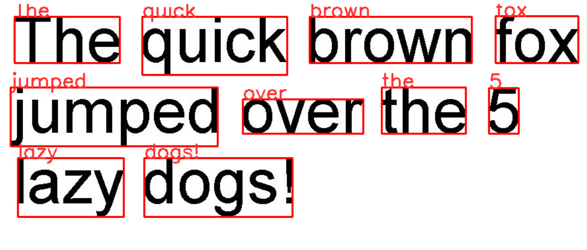

# OCR

<p align="center">
  <a   style="text-decoration:none ; pointer-events: none; cursor: default;" >
    
  </a>
  <a style="text-decoration:none ; pointer-events: none; cursor: default;" >
    
  </a>
  <a style="text-decoration:none pointer-events: none; cursor: default;" >
    
  </a>
</p>

## Project Description
This is an optical character recognition task. That uses open cv and pytesseract libraries to generate a word file of a text document.

## Setup 

```
pip install opencv-python
```

- Download tesseract exe from <a href="https://github.com/UB-Mannheim/tesseract/wiki" target="_blank">here</a>
- Install this exe in C:\Program Files (x86)\Tesseract- OCR

```
pip install  tesseract
```
## Demo Result


